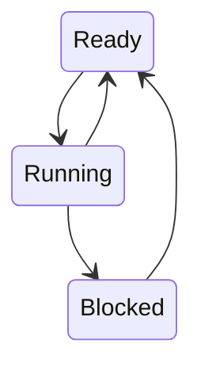

+++
title = '进程基础'
date = 2024-10-21T08:25:27+08:00
tags = ['Operating System']
+++

## 进程

### 进程的状态

一个进程至少有三种基本状态，即就绪、运行、阻塞状态。

1. 就绪状态（Ready）：获得时间片后即可运行
2. 运行状态（Running）：运行状态，进程正在占用 CPU
3. 阻塞状态（Blocked）：进程正在等待某一事件发生，即使拥有 CPU 也无法运行

三种状态之间会因为以下原因发生切换：

- *就绪状态 -> 运行状态*：被调度程序选中，获得时间片，开始运行
- *运行状态 -> 就绪状态*：时间片用完
- *运行状态 -> 阻塞状态*：进程请求某个事件且必须等待，如 I/O 事件
- *阻塞状态 -> 就绪状态*：进程请求的事件发生

除了以上三种状态外，进程还有两种基本的状态：

1. 创建状态（New）：进程正在被创建时的状态
2. 结束状态（Exit）：进程结束时的状态

此外，当进程被阻塞时，可以将该进程相关的内存换出到磁盘中，这种进程存在但没有占据实际物理内存的状态称为「挂起状态」。挂起状态又可以分为 **就绪挂起状态** 和 **阻塞挂起状态**。

### 进程控制块

**进程控制块**（Process Control Block，PCB）是用来进程的数据结构，每个进程对应一个 PCB，PCB 是进程存在的唯一标识。

PCB 通常包含以下信息：

1. 进程描述信息：
    - 进程标识符：每个进程都有一个唯一的标识符
    - 用户标识符：进程所属用户
2. 进程控制、管理信息：
    - 进程状态：进程当前状态
    - 进程优先级：进程调度时的优先级
3. 分配的资源
    - 进程虚拟地址空间
    - 进程打开的文件列表
    - I/O 设备
4. CPU 信息
    - 寄存器的值，如 `eip`，`esp`

## 线程

**线程** 是进程当中的一条执行流程。当进程只有一个线程时，可以认为进程就是线程。

线程与进程十分相似，同样拥有就绪、运行、阻塞等状态，也通过 TCB（Thread Control Block）描述。线程共享进程的数据段、代码段、文件等资源，只独享寄存器、栈等资源。进程是资源分配的基本单位，线程是调度的基本单位。

### 线程的实现

- 用户线程（User Thread）：在用户空间实现的线程，不是由内核管理的线程，是由用户态的线程库来完成线程的管理
- 内核线程（Kernel Thread）：在内核中实现的线程，是由内核管理的线程
- 轻量级进程（LightWeight Process）：在内核中来支持用户线程
