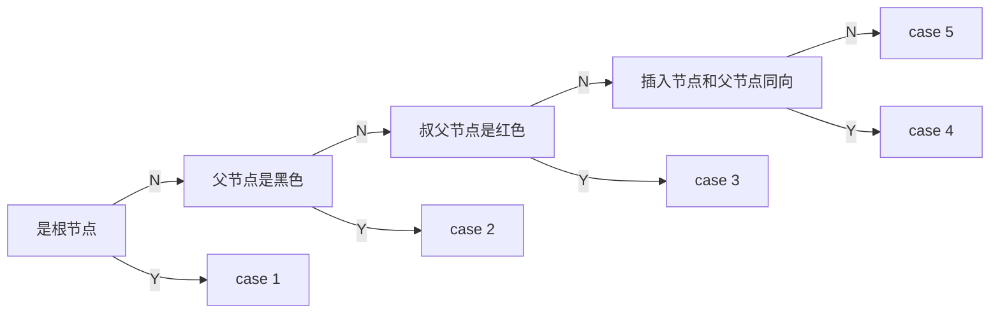

# 红黑树

红黑树是一种平衡的二叉搜索树，满足如下性质：

1. 节点要么是**黑色**，要么是**红色**
2. 所有叶子节点都是黑色
3. 红色节点的子节点必须是黑色
4. 从任一节点到叶子节点的所有简单路径都包含相同数量的黑色节点
5. 根节点必须是黑色

其中叶子节点指的是空节点。如下图所示，`null` 是叶子节点，而节点 9 和节点 20 不是叶子节点（它们的子结点也是叶子节点，图中没有画出）。

```language
        10
      /    \
     8      14
    / \    /  \
 null  9  null 20
```

## 节点定义

```rust
/// 节点颜色
#[derive(Clone, Copy)]
enum Color {
    Red,
    Black,
}

/// 红黑树节点
pub struct RBNode<K: Ord, V> {
    key: K,
    value: V,
    color: Color,
    parent: *mut RBNode<K, V>,
    left: *mut RBNode<K, V>,
    right: *mut RBNode<K, V>,
}

impl<K: Ord, V> RBNode<K, V> {
    /// 默认创建红色节点
    fn new(key: K, value: V) -> RBNode<K, V> {
        RBNode {
            key,
            value,
            color: Color::Red,
            parent: null_mut(),
            left: null_mut(),
            right: null_mut(),
        }
    }
}

/// 红黑树
#[derive(Debug)]
pub struct RBTree<K: Ord, V> {
    root: *mut RBNode<K, V>,
}

impl<K: Ord, V> Default for RBTree<K, V> {
    fn default() -> Self {
        Self::new()
    }
}

impl<K: Ord, V> RBTree<K, V> {
    pub fn new() -> RBTree<K, V> {
        RBTree::<K, V> { root: null_mut() }
    }
}
```
## 旋转

**左旋**指的是将一个节点变成它的右子节点的左子节点的操作，即该节点向左下方旋转，其子节点向左上方旋转，整体呈逆时针旋转。

**右旋**指的是将一个节点变成它的左子节点的右子节点的操作，即该节点向右下方旋转，其子节点向右上方旋转，整体呈顺时针旋转。

```rust
impl<K: Ord, V> RBTree<K, V> {
    /// 左旋节点 `node`。
    /*
     *         p              p
     *        / \            / \
     *          n   ------>    c
     *         / \            / \
     *            c          n
     *           / \        / \
     *         cl             cl
     */
    fn left_rotate(&mut self, node: *mut RBNode<K, V>) {
        unsafe {
            let parent = (*node).parent;
            let right_child = (*node).right;
            let left_gchild = (*right_child).left; // 右子节点的左子节点

            // 调整子节点
            (*right_child).left = node;
            (*right_child).parent = parent;

            // 调整左旋节点
            (*node).parent = right_child;
            (*node).right = left_gchild;

            // 调整孙子节点
            if !left_gchild.is_null() {
                (*left_gchild).parent = node;
            }

            // 调整父节点
            if parent.is_null() {
                self.root = right_child;
            } else if (*parent).left == node {
                (*parent).left = right_child;
            } else {
                (*parent).right = right_child;
            }
        }
    }

    /// 右旋节点 `node`。
    /*
     *         p              p
     *        / \            / \
     *          n   ------>    c
     *         / \            / \
     *        c                 n
     *       / \               / \
     *         cl             cl
     */
    fn right_rotate(&mut self, node: *mut RBNode<K, V>) {
        unsafe {
            let parent = (*node).parent;
            let left_child = (*node).left;
            let right_gchild = (*left_child).right;

            // 调整子节点
            (*left_child).right = node;
            (*left_child).parent = parent;

            // 调整右旋节点
            (*node).parent = left_child;
            (*node).left = right_gchild;

            // 调整孙子节点
            if !right_gchild.is_null() {
                (*right_gchild).parent = node;
            }

            // 调整父节点
            if parent.is_null() {
                self.root = left_child;
            } else if (*parent).left == node {
                (*parent).left = left_child;
            } else {
                (*parent).right = left_child;
            }
        }
    }
}
```

## 插入

红黑树的插入操作与二叉搜索树相似，重点在于插入后需要根据插入节点及相关节点的颜色对树进行调整以满足红黑树的性质。根据性质 4，如果插入的节点是黑色，那么必定会破坏性质 4，所以规定插入节点的颜色为红色。

```rust
impl<K: Ord, V> RBTree<K, V> {
    /// 插入键值对 (key, value)
    pub fn insert(&mut self, key: K, value: V) {
        unsafe {
            let mut node = self.root;
            let mut parent = null_mut();

            // 定位插入位置 parent
            while !node.is_null() {
                parent = node;
                node = match (*node).key.cmp(&key) {
                    Ordering::Less => (*node).right,
                    Ordering::Equal => {
                        (*node).value = value;
                        return;
                    }
                    Ordering::Greater => (*node).left,
                }
            }

            // 创建新节点
            node = Box::into_raw(Box::new(RBNode::new(key, value)));
            // 插入节点
            if !parent.is_null() {
                if (*node).key < (*parent).key {
                    (*parent).left = node;
                } else {
                    (*parent).right = node;
                }
            } else {
                self.root = node;
            }
            (*node).parent = parent;

            // 调整红黑树
            self.insert_fixup(node);
        }
    }
}
```

插入后的情况可以分成以下 5 种：



### case 1

插入节点是根节点，将节点染为黑色即可。

### case 2

插入节点的父节点是黑色，不需要修改。

### case 3

插入节点的父节点是红色，叔父节点也是红色。

此时违反了性质 3，将父节点与叔父节点染黑，祖父节点染红即可局部满足性质 4，然后视祖父节点为插入节点，继续调整红黑树。

### case 4

插入节点的父节点是红色，叔父节点是黑色（或是叶子结点），且插入节点与父节点都是**左子节点**。

此时违反了性质 3，先将父节点染黑，祖父节点染红，然后右旋祖父节点。

```language
        [G]                         [P]                           <P>     
       /   \       Repaint         /   \      Right Rotate G     /   \    
     <P>   [U]  -------------->  <N>   <G>    -------------->  <N>   [G]  
     /                                   \                        \       
   <N>                                   [U]                      [U]     

N: new node, P: parent node, G: grandparent node, U: uncle node
<X>: RED node, [X]: BLACK node, {X}: either RED or BLACK node
```

该情况还有一种对称的变形，即插入节点的父节点是红色，叔父节点是黑色（或是叶子结点），且插入节点与父节点都是**右子节点**。调整方法也类似，不同的是需要**左旋**祖父节点 。

### case 5

插入节点的父节点是红色，叔父节点是黑色（或是叶子结点），且插入节点是**右子结点**，父节点是**左子节点**。

此时**左旋**父节点就变成了 case 4，将父节点视为插入节点继续调整红黑树即可。

```language
        [G]                        [G]   
       /   \     Left Rotate P    /   \  
     <P>   [U]  --------------> <N>   [U]
       \                        /        
       <N>                    <P>        

N: new node, P: parent node, G: grandparent node, U: uncle node
<X>: RED node, [X]: BLACK node, {X}: either RED or BLACK node
```

该情况还有一种对称的变形，即插入节点的父节点是红色，叔父节点是黑色（或是叶子结点），且插入节点是**左子结点**，父节点是**右子节点**。调整方法也类似，只需要**右旋**父节点就会变成 case  4 的另一种变形。

### 示例代码

```rust
impl<K: Ord, V> RBTree<K, V> {
    /// 插入后调整红黑树
    #[inline]
    fn insert_fixup(&mut self, mut node: *mut RBNode<K, V>) {
        unsafe {
            let mut parent: *mut RBNode<K, V> = (*node).parent;
            let mut gparent: *mut RBNode<K, V>;
            let mut tmp: *mut RBNode<K, V>;

            loop {
                // case1 根节点
                if parent.is_null() {
                    (*node).color = Color::Black;
                    break;
                }

                // case 2 父节点是黑色节点
                if matches!((*parent).color, Color::Black) {
                    break;
                }

                gparent = (*parent).parent;
                tmp = (*gparent).right;

                if parent != tmp {
                    // 父节点是左子节点
                    // case 3 父节点和叔父节点都是红色节点
                    if !tmp.is_null() && matches!((*tmp).color, Color::Red) {
                        (*parent).color = Color::Black;
                        (*tmp).color = Color::Black;
                        (*gparent).color = Color::Red;
                        // 视祖父节点为插入节点继续调整红黑树
                        node = gparent;
                        parent = (*gparent).parent;
                        continue;
                    }

                    // case 5
                    tmp = (*parent).right;
                    if node == tmp {
                        self.left_rotate(parent);
                        parent = node;
                    }

                    // case 4
                    (*parent).color = Color::Black;
                    (*gparent).color = Color::Red;
                    self.right_rotate(gparent);
                } else {
                    // 父节点是右子节点
                    // case 3 父节点和叔父节点都是红色节点
                    if !tmp.is_null() && matches!((*tmp).color, Color::Red) {
                        (*parent).color = Color::Black;
                        (*tmp).color = Color::Black;
                        (*gparent).color = Color::Red;
                        node = gparent;
                        parent = (*gparent).parent;
                        continue;
                    }

                    // case 5
                    tmp = (*parent).left;
                    if node == tmp {
                        self.right_rotate(parent);
                        parent = node;
                    }

                    // case 4
                    (*parent).color = Color::Black;
                    (*gparent).color = Color::Red;
                    self.left_rotate(gparent);
                }
                break;
            }
        }
    }
}
```

## 删除

与二叉树的删除操作类似，可以根据待删除的节点有无子节点分为以下几种情况：

### case 1

待删除节点的左右子节点都存在。使用直接后继节点替换待删除节点（不包括颜色），然后删除直接后继节点。

### case 2

待删除节点仅有一个子节点，那么子节点一定是红色，否则违反性质 5。直接使用子节点替换待删除节点（不包括颜色）即可。

### case 3

待删除节点不存在子节点且该节点为红色。直接删除即可。

### case 4

待删除节点不存在子节点且该节点为黑色。删除后会破坏性质 5，需要进行调整。若此节点为根节点，直接删除即可。

### 示例代码

```cpp
    void remove_aux(rb_node *root, const T &value) {
        if (root == nullptr) {
            return;
        }

        if (root->key == value) {
            if (root->count > 1) {
                root->count--;
            } else {
                if (root->left && root->right) { // case 1: 左右子树存在
                    rb_node *successor = min_node(root->right);

                    root->key = successor->key;
                    root->count = successor->count;
                    successor->count = 1;
                    successor->size = 0;

                    remove_aux(root->right, successor->key);
                } else { // 至多存在一棵子树
                    rb_node *child =
                        root->left != nullptr ? root->left : root->right;
                    rb_node *parent = root->parent;

                    // case 2: 仅存在一个子节点
                    if (child) {
                        child->parent = parent;

                        // 调整待删除节点的父节点
                        if (parent == nullptr) { // 待删除节点是根节点
                            this->root = child;
                        } else if (is_left_child(root)) {
                            parent->left = child;
                        } else {
                            parent->right = child;
                        }

                        child->color = rb_color::black;

                    } else if (parent == nullptr) { // case 3: 没有子树的根节点
                        this->root = nullptr;
                    } else { // case 3: 没有子树的黑色节点（非根节点）
                        if (root->color == rb_color::black) {
                            root->size = 0;
                            fix_after_remove(root);
                        }

                        // 调整待删除节点的父节点
                        if (parent) {
                            if (is_left_child(root)) {
                                parent->left = nullptr;
                            } else {
                                parent->right = nullptr;
                            }
                        }
                    }
                    // case 4: 不存在子节点且为红色，直接删除
                    delete root;
                    return;
                }
            }
        } else {
            rb_node *child = root->key > value ? root->left : root->right;
            remove_aux(child, value);
        }

        root->size = root->count + (root->left ? root->left->size : 0) +
                     (root->right ? root->right->size : 0);
    }
```

### 维护

根据上面的各种情况可以发现，只有删除 **没有子节点的黑色节点（非根节点）** 才会破坏红黑树的性质。

以下情况均假设待删除节点是左子节点，对于右子节点的情况，处理方法与左子节点的情况对称。

#### case 1

待删除节点的兄弟节点是红色，那么父节点和侄子节点（兄弟节点的子节点）一定是黑色（或为空）（性质 4），删除节点可能会破坏性质 5。

此时需要将父节点染红，将兄弟节点染黑，并对父节点进行 **左旋**，随后继续维护红黑树。

```language
        [P]                         <P>                         [S]
       /   \       repaint         /   \     Left Rorate P     /   \
     [N]   <S>  -------------->  [N]   [S]  -------------->  <P>   [D]
          /   \                       /   \                 /   \
        [C]   [D]                   [C]   [D]             [N]   [C]

N: delete node, P: parent node, S: sibling node, C: close nephew, D: distant nephew
<X>: RED node, [X]: BLACK node, {X}: either RED or BLACK node
```

#### case 2

待删除的兄弟节点和侄子节点（兄弟节点的子节点）都是黑色（或为空），父节点是红色。删除节点可能会破坏性质 5。

此时只需要将父节点染黑，兄弟节点染红即可。

```language
        <P>                        [P]      
       /   \       repaint        /   \     
     [N]  [S]  -------------->  [N]   <S>   
         /   \                       /   \  
       [C]   [D]                   [C]   [D]

N: delete node, P: parent node, S: sibling node, C: close nephew, D: distant nephew
<X>: RED node, [X]: BLACK node, {X}: either RED or BLACK node
```

#### case 3

待删除节点的兄弟节点和侄子节点（兄弟节点的子节点）都是黑色（或为空），父节点是黑色。

将兄弟节点染红然后视父节点为待删除节点继续调整红黑树。若父节点是根节点，则不需要再调整。

```language
        [P]                        [P]      
       /   \       repaint        /   \     
     [N]  [S]  -------------->  [N]   <S>   
         /   \                       /   \  
       [C]   [D]                   [C]   [D]

N: delete node, P: parent node, S: sibling node, C: close nephew, D: distant nephew
<X>: RED node, [X]: BLACK node, {X}: either RED or BLACK node
```

#### case 4

待删除节点的兄弟节点是黑色，左侄子节点是红色，右侄子节点是黑色（或为空），父节点是黑色或红色。

将兄弟节点染红，左侄子节点染黑，然后 **右旋** 兄弟节点，此时满足 case 5。

```language
        {P}                         {P}                         {P}
       /   \       repaint         /   \    Right Rorate S     /   \
     [N]   [S]  -------------->  [N]   <S>  -------------->  [N]   [C]
          /   \                       /   \                           \
        <C>   [D]                   [C]   [D]                         <S>

N: delete node, P: parent node, S: sibling node, C: close nephew, D: distant nephew
<X>: RED node, [X]: BLACK node, {X}: either RED or BLACK node
```

#### case 5

待删除节点的兄弟节点是黑色，左侄子节点是黑色（或为空），右侄子节点是红色，父节点是黑色或红色。

父节点与兄弟节点交换颜色，右侄子节点染黑，**左旋** 父节点。

```language
        {P}                         [P]                         {S}
       /   \       repaint         /   \    Right Rorate S     /   \
     [N]   [S]  -------------->  [N]   {S}  -------------->  [P]   [D]
          /   \                       /   \                 /   \      
        {C}   <D>                   {C}   [D]             [N]   {C}      

N: delete node, P: parent node, S: sibling node, C: close nephew, D: distant nephew
<X>: RED node, [X]: BLACK node, {X}: either RED or BLACK node
```

#### 示例代码

```cpp
    /**
     *  @brief  调整红黑树
     *  @param  root  待删除的节点
     *
     *  因为还需要待删除节点来定位其父节点和兄弟节点等节点，所以此时调整的红黑
     *  树其实是未删除节点的红黑树。
     *
     *  case a + case b = case 1 + case 2
     *  !case a + case b = case 2 / case 3
     *  !case a + !case b + case c + case d = case 4 + case 5
     *  !case a + !case b + !case c + case d = case 5
     */
    void fix_after_remove(rb_node *root) {
        while (root != this->root && root->color == rb_color::black) {
            if (is_left_child(root)) {
                rb_node *sib = root->parent->right;

                // case a
                if (is_red(sib)) {
                    sib->color = rb_color::black;
                    root->parent->color = rb_color::red;
                    right_right_rotation(root->parent);
                    sib = root->parent->right;
                }

                // case b
                if (is_black(sib->left) && is_black(sib->right)) {
                    sib->color = rb_color::red;
                    root = root->parent;
                } else {
                    // case c
                    if (is_black(sib->right)) {
                        sib->left->color = rb_color::black;
                        sib->color = rb_color::red;
                        left_left_rotation(sib);
                        sib = root->parent->right;
                    }

                    // case d
                    sib->color = root->parent->color;
                    root->parent->color = rb_color::black;
                    sib->right->color = rb_color::black;
                    right_right_rotation(root->parent);
                    root = this->root;
                }
            } else {
                rb_node *sib = root->parent->left;

                // case a
                if (is_red(sib)) {
                    sib->color = rb_color::black;
                    root->parent->color = rb_color::red;
                    left_left_rotation(root->parent);
                    sib = root->parent->left;
                }

                // case b
                if (is_black(sib->right) && is_black(sib->left)) {
                    sib->color = rb_color::red;
                    root = root->parent;
                } else {
                    // case c
                    if (is_black(sib->left)) {
                        sib->right->color = rb_color::black;
                        sib->color = rb_color::red;
                        right_right_rotation(sib);
                        sib = root->parent->left;
                    }

                    // case d
                    sib->color = root->parent->color;
                    root->parent->color = rb_color::black;
                    sib->left->color = rb_color::black;
                    left_left_rotation(root->parent);
                    root = this->root;
                }
            }
        }
        root->color = rb_color::black;
    }
```

## 参考资料

1. [OI Wiki](https://oi-wiki.org/ds/rbtree/)
2. [pdai tech](https://pdai.tech/md/algorithm/alg-basic-tree-redblack.html)
3. [pdai tech](https://pdai.tech/md/java/collection/java-map-TreeMap&TreeSet.html)
4. [Open JDK](https://github.com/openjdk/jdk/blob/master/src/java.base/share/classes/java/util/TreeMap.java#L2705)
5. [Wikepadia](https://zh.wikipedia.org/wiki/%E7%BA%A2%E9%BB%91%E6%A0%91)
