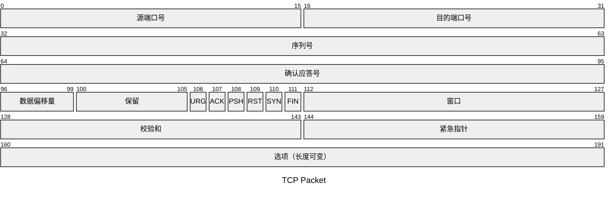
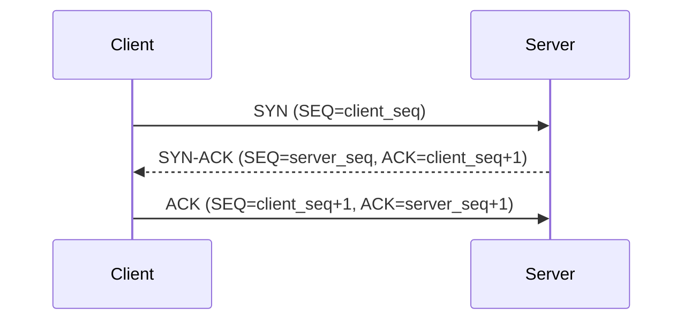
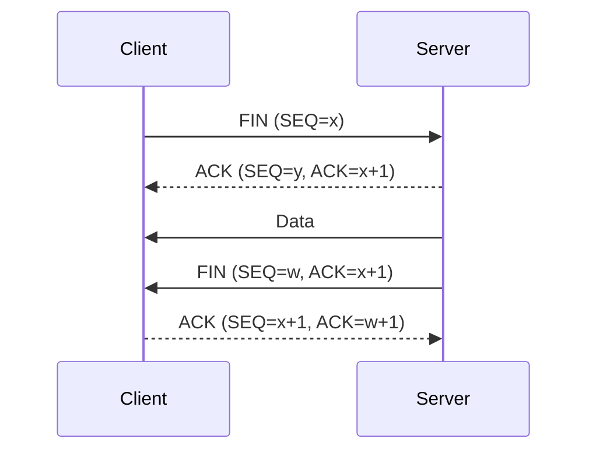
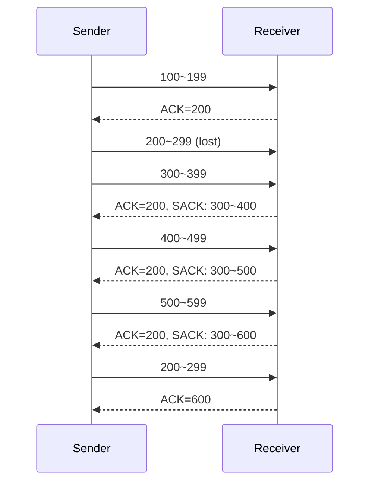
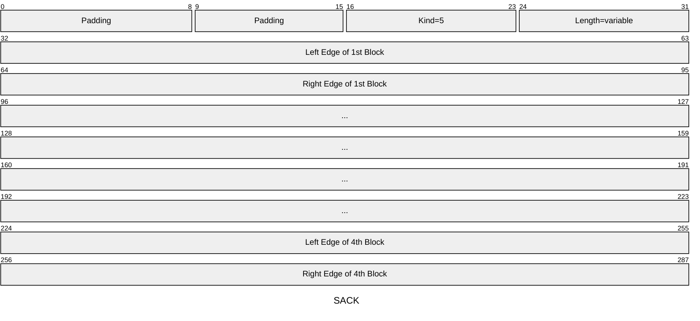

+++
title = 'TCP 基础'
date = 2024-07-07T09:03:08+08:00
+++

## TCP 首部



**序列号**：TCP 是面向字节流的，其传输的每一个数据字节都对应一个序列号。序列号的初始值是一个随机数，每发送一次 TCP 报文序列号都会累加一次报文的数据字节数

**确认应答号**：下一次期望收到的数据的序列号

**数据偏移量**：数据部分的偏移量，也就是首部的长度。单位为 4 字节。因此 TCP 首部最长为 $(2^4-1)*4=60$ 字节。

**控制位**：

- *ACK*：该位为 1 时表示确认应答字段有效，除最初建立连接时的 `SYN` 包外该位必须置 1
- *RST*：该位为 1 时表示 TCP 连接出现异常必须强制断开连接
- *SYN*：该位为 1 时表示希望建立 TCP 连接，并在其序列号字段确定序列号初始值
- *FIN*：该位为 1 时表示今后不会再有数据发送，希望断开 TCP 连接

## TCP 连接

### 三次握手

建立一个 TCP 连接需要经过三次握手过程。



- 第一次握手：`SYN` 报文
客户端将 `SYN` 字段置为 1，表示希望建立连接，并随机初始化序列号，该报文 **不包含数据**。之后客户端进入 `SYN-SENT` 状态。
- 第二次握手：`SYN-ACK` 报文
服务端收到客户端的 `SYN` 报文后，也随机初始化自己的序列号，并将 `client_seq+1` 作为确认应答号，同时将 `SYN` 和 `ACK` 字段置为 1。该报文 **不包含数据**。之后服务端进入 `SYN-RCVD` 状态。
- 第三次握手：`ACK` 报文
客户端收到服务端的报文后，向服务端发送 `ACK` 报文。该报文的序列号为 `client_seq+1`，确认应答号为 `server_seq+1`，`ACK` 字段置为 1。该报文 **可以包含数据**。之后客户端进入 `ESTABLISHED` 状态。
服务端收到 `ACK` 报文后也会进入 `ESTABLISHED` 状态，此时连接成功建立。

### 四次挥手

关闭一个 TCP 连接需要经过三次挥手过程。



- 第一次挥手：客户端 `FIN` 报文
客户端向服务端发送 `FIN` 字段为 1 的报文，表示关闭 TCP 连接，客户端进入 `FIN_WAIT_1` 状态，不再向服务端发送数据。
- 第二次挥手：服务端 `ACK` 报文
服务端接收到客户端的 `FIN` 报文后发送 `ACK` 报文，服务端进入 `CLOSE_WAIT` 状态。此时服务端仍能向客户端发送数据。
客户端接收到该 `ACK` 报文后进入 `FIN_WAIT_2` 状态。
- 第三次挥手：服务端 `FIN` 报文
服务端向客户端发送 `FIN` 字段为 1 的报文，表示关闭 TCP 连接，服务端进入 `LAST_ACK` 状态，不再向客户端发送数据。
- 第四次挥手：服务端 `ACK` 报文
客户端接收到服务端的 `FIN` 报文后发送 `ACK` 报文，客户端进入 `TIME_WAIT` 状态。客户端在经过 `2MSL` 时间后，自动进入 `CLOSE` 状态，完成关闭。
服务端接收到 `ACK` 报文后进入 `CLOSE` 状态，完成关闭。

## 重传

**重传** 是 TCP 实现可靠传输的方式之一。发送端的数据到达接收端后，接收端会回复一个确认报文，表示已收到。在错综复杂的网络中，数据可能在传输过程中丢失，因此需要重新传输丢失的数据。数据丢失有两种情况：

1. 数据报文丢失（接收端没有收到数据报文）
2. 确认报文丢失（发送端没有收到确认报文）

### 超时重传

每一个数据报发送时都会设置一个定时器，若超过指定时间没有收到确认报文，就会重发该数据。这就是 **超时重传**。

超时重传的时间通常略大于往返时延（[详情见处](https://www.xiaolincoding.com/network/3_tcp/tcp_feature.html#%E8%B6%85%E6%97%B6%E9%87%8D%E4%BC%A0)）。

若超时重传的数据超时，TCP 采取 **超时间隔加倍** 策略。也就是说，每遇到一次超时，下一次超时重传的时间都是上次的两倍。

超时重传存在等待时间过长的问题。

### 快速重传

**快速重传** 可以有效解决 **超时重传** 时间过长的问题。

假设发送端向接收端发送 6 个数据报，它们的序列号分别为：`Seq1`、`Seq2`、`Seq3`、`Seq4`、`Seq5`。其中序列号为 `Seq2` 的数据报丢失，接收端收到 `Seq1` 后回复 `ACK` 报文，收到 `Seq3` 及其后的数据报时，因为 `Seq2` 丢失（接收端没有收到），回复了 3 个相同的 `ACK` 报文（确认应答号均为 `Seq2`）。

收到三个相同的 `ACK` 报文后，发送端会在定时器过期之前重发对应的数据，这就是 **快速重传**。

最后接收端收到了 `Seq2`，于是 `ACK` 报文的确认应答号为 `Seq6`。

对于上面单个数据报丢失的情况，快速重传的等待时间较短，但若出现多个数据报丢失，后面的数据报必须在前面的数据报被接收后才能触发快速重传，这又会增加重传的等待时间。如果全部重传后面的数据，那么已接收的数据就被浪费了。

### SACK

**选择性确认** （Selective Acknowledge，SACK）可以将已收到的数据告诉发送端，从而可以只重传丢失的数据。



当接收端收到乱序的数据报时（序列号比确认号大）会在 `ACK` 报文中加上 `SACK` 选项以告知发送端已接收的部分。发送端在触发快速重传时根据确认号和 `SACK` 选项得知丢失的数据部分并重传该部分。

#### `SACK` 选项

`SACK` 选项包含两个选项。

- `SACK-Permitted` 选项
该选项只能出现在 `SYN` 报文中，在连接建立时告知对方自己支持 `SACK`。选项格式如下：


- `SACK` 选项
该选项通过范围表示已经接收到的数据，不连续的部分就是丢失的数据。



### D-SACK

Duplicate SACK 又称 D-SACK，其主要使用 SACK 来告诉发送方有哪些数据被重复接收了。

## 流量控制

在通信过程中，发送方不能无脑地向接收方发送数据，接收方可能无法及时处理数据而丢失数据，从而触发发送方的重传导致浪费网络流量。

因此，TCP 提供了一种可以让发送方根据接收方的实际接收能力控制发送的数据量的机制，也就是 **流量控制**。

### 累计应答

发送方收到确认报文后就可以认为该确认号之前的数据已全部被接收，即使没有收到前面的数据的确认报文。

### 滑动窗口

- **接收窗口**：接收端处理数据的能力，通过 TCP 首部的 `Window` 字段告知
- **发送窗口**：控制发送端发送数据，约等于 **接收窗口**

窗口并不是一成不变的，而是会根据当前的应用、系统运行情况，网络状况等动态地变化，变化会通过首部的 `Window` 字段告知对端。

#### 发送端的窗口

```language
|30|31|32|33|34|35|36|37|38|39|40|41|42|43|44|45|46|47|48|49|50|51|52|53|54|55|
       ^                                                        ^              
       |            send window(20 bytes)                       |
                                                 ^              ^
                                                 |free window(6)|
|  #1  |                    #2                   |      #3      |     #4      |
```

- #1：已发送且已确认的数据
- #2：已发送但未确认的数据
- #3：未发送但可发送的数据
- #4：未发送且不可发送的数据

当可发送数据全部发送之后，可用窗口变为 0，表示接收端已经达到最大处理能力，不应再向其发送数据。

```language
|30|31|32|33|34|35|36|37|38|39|40|41|42|43|44|45|46|47|48|49|50|51|52|53|54|55|
       ^                                                        ^              
       |            send window(20 bytes)                       |
|  #1  |                             #2                         |     #3      |
```

当收到确认报文后，窗口就会向右 **滑动**，从而可用窗口不为 0，可以继续发送数据。

```language
|30|31|32|33|34|35|36|37|38|39|40|41|42|43|44|45|46|47|48|49|50|51|52|53|54|55|
                ^                                                        ^     
                |              send window(20 bytes)                     |
                                                                   ^     ^
                                                                   |free |
|      #1       |                    #2                            |  #3 | #4 |
```

可用窗口的计算公式为：

```language
可用窗口 = 窗口大小 - (可发送的第一字节 - 已发送未确认的第一字节)

不可发送的第一字节 = 已发送未确认的第一字节 + 窗口大小
```

#### 接收端的窗口

接收端的窗口相对简单，没有可用窗口的概念。

```language
|30|31|32|33|34|35|36|37|38|39|40|41|42|43|44|45|46|47|48|49|50|51|52|53|54|55|
       ^                                                        ^              
       |            send window(20 bytes)                       |
|  #1  |                             #2                         |     #3      |
```

#### 窗口大小

TCP 首部的 `Window` 字段只有 16 位，最大表示 65535 字节。窗口缩放选项可以突破这个限制。

```language
Window Scale option (WSopt): Kind: 3, Length: 3
    +---------+---------+---------+
    | Kind=3  |Length=3 |shift.cnt|
    +---------+---------+---------+
         1         1         1
```

窗口缩放选项只能在 `SYN` 报文中确认且必须双方都启用才能生效，缩放因子确认后就不能再更改。之后的报文必须都包含窗口缩放选项。缩放因子最大有效值为 14。窗口大小的计算公式如下：

$$
Size = Window * 2^{Scale}
$$

#### 窗口关闭

当接收端发送 `Window=0` 的报文时，发送端就会停止发送数据，直到再次收到窗口值为非 0 的报文。此时若接收端的窗口非 0 报文丢失则可能会造成死锁。为了避免死锁，TCP 在收到零窗口通知时会启动 **持续计时器**。如果计时器超时，就会发送 **窗口探测报文**，对方在确认该报文时会给出新的窗口大小。如果新窗口仍为 0 则会重新启动持续计时器。一定次数后若窗口仍为 0，那么 TCP 将强制中断连接。

#### 糊涂窗口综合征

如果接收端的数据处理速度太慢，会导致发送端的发送窗口越来越小。到最后，只要接收端能够接收数据，发送端都会发送数据，哪怕只有几字节，这就是 **糊涂窗口综合征**。

糊涂窗口综合征发生的条件有两个：

1. 接收端可以通告小窗口
2. 发送端可以发送小数据

于是，避免出现以上两种情况便能避免糊涂窗口综合征。

针对条件 1，可以让窗口大小小于 `min(MSS, 缓存空间/2)` 时发送零窗口通知，阻止发送端继续发送数据，等待接收端处理一些数据后再打开窗口。

针对条件 2，发送端使用 Nagle 算法，只有满足以下 ***任一*** 条件时才发送数据：

1. 窗口大小大于或等于 `MSS` 并且数据大小大于或等于 `MSS`
2. 收到之前发送数据的确认报文

```c
if 有数据要发送 {
    if 可用窗口大小 >= MSS && 可发送的数据 >= MSS {
        立刻发送MSS大小的数据
    } else {
        if 有未确认的数据 {
            将数据放入缓存等待接收 ACK
        } else {
            立刻发送数据
        }
    }
}
```

如果接收端可以通告小窗口，那么即使开启 Nagle 算法也无法避免糊涂窗口综合征。因为如果对端确认报文回复得快的话（满足 Nagle 算法条件 2），Nagle 算法就无法等到数据足够多时再进行传输。

因此，接收端不通告小窗口且发送端开启 Nagle 算法才可以避免糊涂窗口综合征。

## 拥塞控制

流量控制可以避免发送端的数据填满接收端的缓存，但并不考虑网络的拥塞状况。当网络拥堵时，如果继续发送大量数据会造成数据包丢失等情况，此时，TCP 会开始重传数据，这样会进一步加剧网络拥堵，从而陷入恶性循环。

为此，TCP 引入了 **拥塞控制**，避免发送端的数据填满网络。

### 拥塞窗口

**拥塞窗口** 是发送端维护的一个变量，它会根据网络的拥塞程度动态变化。

加入拥塞窗口后，**发送窗口** 的大小为 `min(拥塞窗口, 接收窗口)`。

当网络没有出现拥塞时，拥塞窗口会增大，当出现拥塞时，拥塞窗口就会减小。TCP 通过**超时重传**判断网络是否出现拥塞。

### 慢启动

慢启动的核心规则是：**每收到一个 ACK，拥塞窗口就会加 1**。

假设拥塞窗口 `cwnd` 初始值为 1 个 `MSS`，

- 连接建立后，发送端发送 `cwnd` 字节数据
- 收到 ACK 后，`cwnd` 加 1，变为 2 个 `MSS`，继续发送数据
- 收到 2 个 ACK 后，`cwnd` 加 2，变为 4 个 `MSS`，继续发送数据
- ……

由此可见，每一轮 RTT 后，`cwnd` 变为原来的两倍，在慢启动阶段，拥塞窗口呈指数增长。


当 `cwnd` 大于慢开始门限 `ssthresh` 后，就会进入 **拥塞避免** 阶段。

### 拥塞避免

慢启动的核心规则是：**每收到一个 ACK，拥塞窗口就会增加 1/cwnd**。

假设此时拥塞窗口 `cwnd` 为 8 个 `MSS`，

- 发送端发送 8 个长度为 `MSS` 的数据报
- 收到 8个 ACK 后，`cwnd` 加 1，变为 9 个 `MSS`，继续发送数据
- 收到 9 个 ACK 后，`cwnd` 加 1，变为 10 个 `MSS`，继续发送数据
- ……

由此可见，每一轮 RTT 后，`cwnd` 加 1，在拥塞避免阶段，拥塞窗口呈线性增长。


### 拥塞发生

随着拥塞窗口的增加，拥塞不可避免地发生，TCP 通过是否发生重传来判断拥塞情况。

#### 超时重传

发生超时重传时，TCP 会先将 `ssthresh` 设为 `cwnd/2`，并将 `cwnd` 重置为初始值，然后进入慢启动。


#### 快速重传

当发生快速重传时，TCP 会先将 `cwnd` 设为 `cwnd/2`，并将 `ssthresh` 设为 `cwnd`，然后执行 **快速恢复** 算法。

快速恢复算法如下：

1. `cwnd = ssthresh + 3`。3 表示收到的三个重复的 ACK
2. 重传数据报
3. 每收到一个同样的 ACK，`cwnd` 加 1，每 3 个相同的 ACK 触发一次快速重传
4. 重复 3 直至收到新的 ACK。收到新的 ACK 后将 `cwnd` 设为 `ssthresh` 并进入拥塞避免阶段


快速重传是为了尽快将丢失的数据发送给对方，所以在收到相同的 ACK 后 `cwnd` 会加 1 以加快从对端获得 ACK 的速度。
