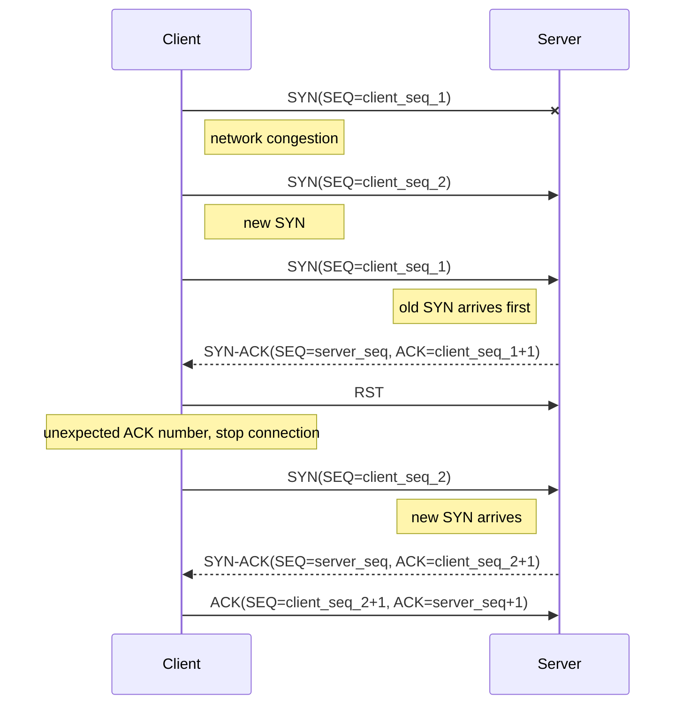
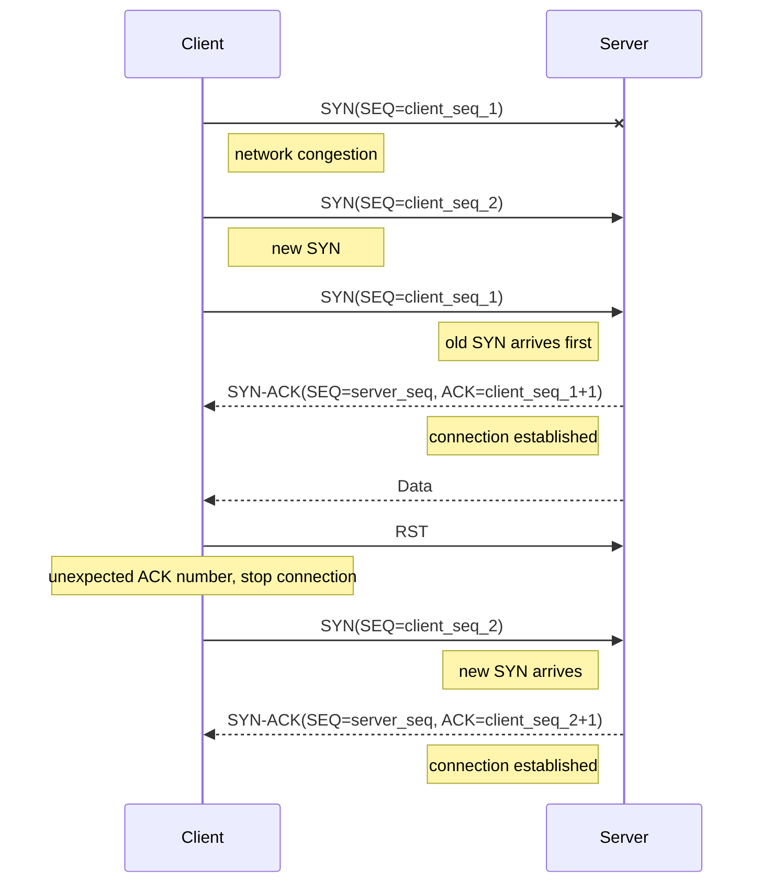
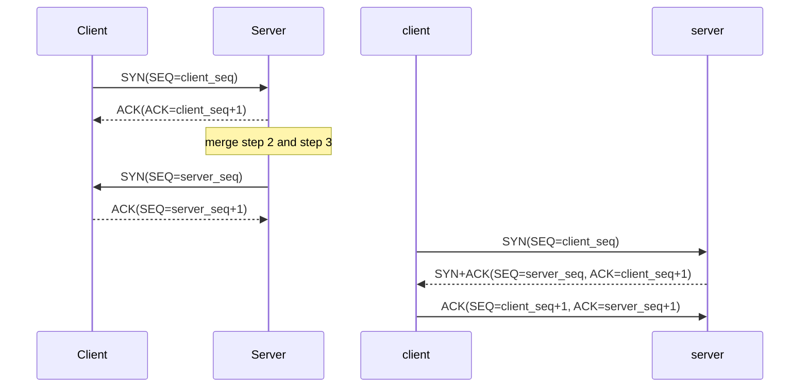

+++
title = 'TCP 连接'
date = 2024-10-31T14:33:33+08:00
draft = true
+++

## 如何唯一确定一个 TCP 连接

一个 TCP 四元组可以唯一确定一个 TCP 连接，四元组包括：

- 源 IP 地址
- 源端口
- 目的 IP 地址
- 目的端口

基于此，可以回答一系列问题。

### 多个 TCP 服务进程可以绑定到同一个端口吗？

四元组唯一确定一个 TCP 连接，在其他三个参数都相同的情况下，如果源端口也相同，那么就只能确定一个 TCP 连接如果源 IP 地址不同，源端口相同，那么 TCP 连接就不唯一。所以，如果源 IP 地址相同，那么多个 TCP 服务进程不能同时绑定到同一个端口，如果源 IP 地址不同，那么多个 TCP 服务进程可以绑定到同一个端口。

### 客户端的端口可以复用吗？

四元组唯一确定一个 TCP 连接，只要四元组中任一参数发生变化，那么就表示不同的 TCP 连接。当客户端的某一端口被占用时，如果新的 TCP 连接源 IP 地址和源端口不和原来的相同，那么就可以使用该端口。

### TCP 和 UDP 可以绑定同一个端口吗？

TCP 和 UDP 是在内核中是两个完全不同的模块，将四元组扩展到五元组就可唯一确定一个 TCP 或 UDP 进程。

- TCP/UDP
- 源 IP 地址
- 源端口
- 目的 IP 地址
- 目的端口

根据五元组，即使其他四个参数完全相同，也可以区分出 TCP 进程和 UDP 进程。

## 为什么是三次握手？

### 避免历史连接

三次握手的主要目的就是 **避免重复连接** 造成混乱和浪费。

先来看一下三次握手如何避免重复连接。

客户端向服务端发起连接，发送 SYN 报文（Seq=client_seq_1），随后客户端宕机且该 SYN 报文被阻塞。客户端重启后重新向服务端发起连接，发送新的 SYN 报文（Seq=client_seq_2）。这两个 SYN 报文的四元组完全相同，但序列号不同。

此时，旧的 SYN 报文先到达服务端，服务端回复 SYN+ACK 报文（ACK=client_seq_1+1），客户端发现收到的确认号不是 `client_seq_2+1`，发送 RST 报文，服务端释放连接。随后，新的 SYN 到达服务端，服务端与客户端正确建立连接。



如果服务端在收到 RST 报文之前收到了新的 SYN 报文，会回复 **Challenge ACK** 报文，该报文的确认号不是新的 SYN 报文，而是上一次的确认号，客户端在收到这个报文后发现不是期望的确认号，于是发送 RST 报文。

再来看看两次握手能否阻止历史连接。

可以看到在第二次握手后成功建立了旧 SYN 报文的连接，服务端开始发送数据。随后服务端收到 RST 报文，释放连接，先前发送的数据全部被浪费了。两次握手没有一个中间状态给客户端来阻止历史连接，导致服务端可能建立一个历史连接，造成浪费。



### 同步序列号

序列号是保证 TCP 可靠传输的关键之一，连接双方要确保自己的序列号被对方正确接收。

两次握手保证一方的序列号被正确接收，三次握手是同步序列号所需的最少次数。



## 三次握手丢失分别会发生什么？

### 第一次握手丢失

第一次握手，也就是 SYN 报文丢失后，会触发 **超时重传**，重传的 SYN 报文的序列号相同。重传一定次数后若仍收不到 SYN-ACK 报文则会在等待一段时间（上次超时等待时间的两倍）后断开此次连接。在 Linux 中，SYN 的重传次数由内核参数 `/proc/sys/net/ipv4/tcp_syn_retries` 控制。

### 第二次握手丢失

假设客户端向服务端发起连接。第二次握手，也就是 SYN-ACK 报文丢失后，客户端因为收不到 SYN-ACK 报文，触发超时重传，服务端因为收不到 ACK 报文，也触发超时重传。在 Linux 中，SYN-ACK 的重传次数由内核参数 `/proc/sys/net/ipv4/tcp_synack_retries` 控制。

### 第三次握手丢失

假设客户端向服务端发起连接。第三次握手，也就是 ACK 报文丢失。因为 ACK 报文（不携带数据）不会被重传，所以只有服务端会触发超时重传，重传 SYN-ACK 报文。如果客户端在发送第三次握手的 ACK 报文后又发送了数据，那么服务端可以根据后面发送的数据报文进行确认。因为这些数据报文的确认号与第三次握手的确认号完全相同。

## 为什么是四次挥手？

当服务端收到客户端的 FIN 报文时，内核会先回复一个 ACK 报文，服务端会等到所有数据发送完毕后再发送 FIN 报文。因此一共需要四次挥手才能断开连接。

但在特定情况下，四次挥手可以变成三次挥手。

### 延迟确认

**延迟确认** 是为了解决不携带数据的 ACK 传输效率低的问题。一般情况下，内核在收到一个报文后会立即回复一个 ACK，但不携带数据的 ACK 报文传输效率太低。

延迟确认的策略为：

1. 当有响应数据要发送时，ACK 随数据一起发送
2. 当没有响应数据要发送时，ACK 将延迟一段时间（200 ms），以等待是否有响应数据要发送
3. 在延迟过程中收到数据时，立刻发送 ACK

在 Linux 中，延迟确认是默认开启的，可以通过 socket 选项 `TCP_QUICKACK` 关闭（局部关闭）。

### 三次挥手

在四次挥手中，因为服务端可能仍有数据要发送，所以 ACK 和 FIN 报文需要分开发送。而在服务端没有数据且开启延迟确认的情况下，ACK 和 FIN 将被合并到一个报文中。

因为开启了延迟确认，所以服务端在收到客户端的 FIN 报文后并不会立刻回复 ACK，而是进行延迟，等待是否有数据需要发送。此时若服务端没有数据要发送，就会向客户端发送 FIN 报文，受到延迟的 ACK 会与 FIN 合并一起发送。

## 关闭连接的函数

### `close()`

`close()` 会像关闭文件描述符一样关闭 socket，如果有多个进程或线程在使用 socket，那么只会减少 socket 的引用计数，直到引用计数为 0 才会发送 FIN 报文。

`close()` 会同时关闭 socket 的发送方向和读取方向，这意味着 socket 不再具有发送和接收数据的能力。

### `shutdown()`

`shutdown()` 可以更精细的控制 socket，它可以仅关闭单一方向，也可以同时关闭两个放方向。但是 `shutdown()` 不管引用计数，会直接使得 socket 不可用，对其他进程或线程产生影响。

## 四次挥手丢失分别会发生什么？

假设客户端主动向服务端断开连接。

### 第一次挥手丢失会发生什么？

第一次挥手，也就是客户端的 FIN 报文丢失后，会触发 **超时重传**。重传一定次数后若仍收不到 ACK 报文则会在等待一段时间（上次超时等待时间的两倍）后断开此次连接。在 Linux 中，SYN 的重传次数由内核参数 `/proc/sys/net/ipv4/tcp_orphan_retries` 控制。

### 第二次挥手丢失会发生什么？

第二次挥手，也就是服务端的 ACK 报文丢失后，因为 ACK 报文（不携带数据）不会被重传，所以只有客户端会触发超时重传，重传 FIN 报文。

### 第三次挥手丢失会发生什么？

第三次挥手，也就是服务端的 FIN 报文丢失后，服务端会触发超时重传，而客户端此时处于 FIN_WAIT_2 状态。

当使用 `close()` 关闭连接时，因为 socket 已经不能发送和接受数据，所以主动关闭方的 FIN_WAIT_2 状态不会持续太久，通常在 60 秒（可通过 `tcp_fin_timeout` 控制）后 TCP 连接就会被直接关闭。如果在 FIN_WAIT_2 状态收到对端发来的数据，内核会回复 RST 报文，然后释放连接。

如果通过 `shutdown()` 仅关闭发送方向，在进入 FIN_WAIT_2 状态后，主动关闭方仍能接受来自对端的数据，但如果对端的 FIN 报文丢失，那么主动关闭方会一直等待下去，`tcp_fin_timeout` 无法控制 `shutdown()` 关闭的连接，系统也不会主动杀死处于 FIN_WAIT_2 状态下的 TCP 连接。

### 第四次挥手丢失会发生什么？

第四次挥手，也就是客户端的 ACK 报文（不携带数据，不会重传）丢失后，此时客户端进入 TIME_WAIT 状态，在等待 2MSL 时间后就会自动关闭连接。服务端没有收到确认报文会触发超时重传，客户端收到重传的 FIN 会重置等待时间，如此往复直至服务端重传一定次数后关闭连接。

## 序列号

### 初始序列号是如何产生的？

```language
ISN = M + F(localhost, localport, remotehost, remoteport)
```

其中 `M` 是一个计时器，每 4 微秒加 1，`F` 是一个 Hash 算法，根据源 IP，目的 IP，源端口，目的端口生成一个随机数。

### 为什么要求初始序列号是随机的？

主要有两方面原因：

- 防止历史报文被后续相同四元组的连接错误接收
- 防止黑客伪造的相同序列号的 TCP 报文被对端接收

假设初始序列号都是从 0 开始。客户端和服务端建立 TCP 连接后，客户端发送的数据被网络阻塞了，此时服务端出现故障重启，TCP 连接被强制关闭。随后客户端又和服务端建立连接，此时被阻塞的数据抵达服务端，**且序列号刚好落在服务端的接收窗口内，该数据报被服务端正常接收**，造成数据错乱。这在初始序列号都是相同的情况下是完全有可能的。

而采用随机的初始序列号可以 **很大程度地** 避免这种现象，但并不能完全避免。序列号长度为 4 字节，根据初始序列号的算法，每 4.55 个小时就会出现回绕。因此，无法通过序列号的大小判断是否是历史报文。

## TIME_WAIT

### 为什么需要 TIME_WAIT 状态

- **防止历史报文被后续相同四元组的连接错误接收**

假设没有 TIME_WAIT 状态。客户端和服务端在建立 TCP 连接后，客户端发送的数据被网络阻塞，随后客户端和服务端正常关闭连接并迅速建立新的连接，此时被阻塞的数据抵达服务端，**且序列号刚好落在服务端的接收窗口内，该数据报被服务端正常接收**，造成数据错乱。为了避免这种情况，TCP 设计了 TIME_WAIT 状态，该状态回持续 `2 MSL` 的时间。

`MSL`，报文最大生存时间（Maximum Segment Lifetime），它是任何报文在网络上存活的最长时间。`MSL` 是根据 IP 的 `TTL` 字段确定的`TTL` 字段表示一个 IP 数据报可以经过的最大路由数，当值为 0 时，该数据报会被丢弃，`MSL` 应该大于或等于 `TTL` 。

`TTL` 的值一般是 64，Linux 将 `MSL` 设置为 30 秒，这表示 Linux 认为数据报文经过 64 个路由的时间不会超过 30 秒。

等待 `2 MSL` 足够让此次连接中被网络阻塞的数据报自然消失在网络中。

- **帮助对端正确关闭 TCP 连接**

如果没有 TIME_WAIT 状态，主动关闭方在回复 ACK 报文后直接进入 CLOSE 状态，那么在收到对端重传的 FIN 报文时就会回复 RST 报文，从而导致对端异常关闭。

等待 `2 MSL` 意味着 **至少允许报文丢失一次**，确保最后的 ACK 报文能让被动关闭方接收，从而帮助其正常关闭。若主动关闭方的 ACK 在第一个 `MSL` 内丢失，那么被动方重传的 `FIN` 就可以在第二个 `MSL` 内到达，主动关闭方可以正确做出回复。当主动关闭方收到重传的 FIN 报文时，TIME_WAIT 状态会重新计时。

## TCP 保活机制

**TCP 保活机制** 可以在连接双方长时间不发生数据交互时探测对端是否仍正常工作。每隔一个时间间隔，TCP 会发送一个探测报文，如果连续几个报文都没得到响应，就认为当前 TCP 连接已经死亡。

当对端接收到探测报文后，可能有出现的情况有：

1. 对端程序正常响应探测报文，TCP 保活机制被重置
2. 对端主机宕机并重启，对端正常接收报文，但因为没有对应的 TCP 连接，回复 RST 报文
3. 对端主机宕机未重启，探测报文丢失，达到探测次数后通告该连接死亡

在 Linux 中，保活机制的参数有：

```c
net.ipv4.tcp_keepalive_time=7200 // 保活时间 7200 秒（2 小时）
net.ipv4.tcp_keepalive_intvl=75  // 每次检测时间间隔 75 秒
net.ipv4.tcp_keepalive_probes=9  // 检测次数 9 次
```

由以上参数可知，在 Linux 系统中，至少需要 2 小时 11 分 15 秒才能发现一个死亡连接：

```language
7200 + (75 * 9) = 7875 s
```

